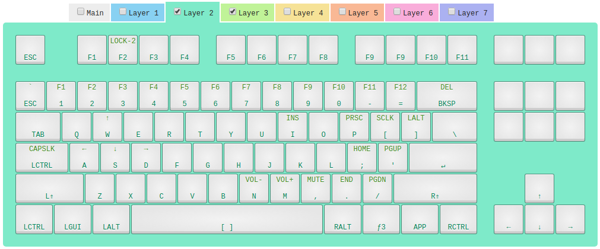

# iKBC (New) Poker II
The new-poker-ii directory contains a [KLL](https://input.club/kll/) firmware layout that emulates the
iKBR New Poker II keyboard layout + default function layer.

The iKBC New Poker II is a "60%" keyboard.
Press "f1+F2" (layer-1 key + F2 key) to enter the iKBC New Poker II mode. All this does is locks
the keyboard to a layer 2 I created which is a copy of the Poker II profile. To return your k-type
keyboard to default, press "f1+F2" again. This re-locks it to the main layer.
:bulb: "f1" is the key labeled "Fn" on your keyboard - next to LeftAlt. "F1" is the key labeled "F1" on your keyboard.

Want to try a 60% keyboard before buying one? Use this configuration to give the Poker II a test run.

### Flashing Your Keyboard
To use one of these layout profiles, clone this repository to your local machine and navigate
to the directory from whichever layout profile you want. Then follow
[the instructions](https://github.com/kiibohd/controller/blob/master/Documentation/Keyboards/K-Type.md)
to flash the firmware.
